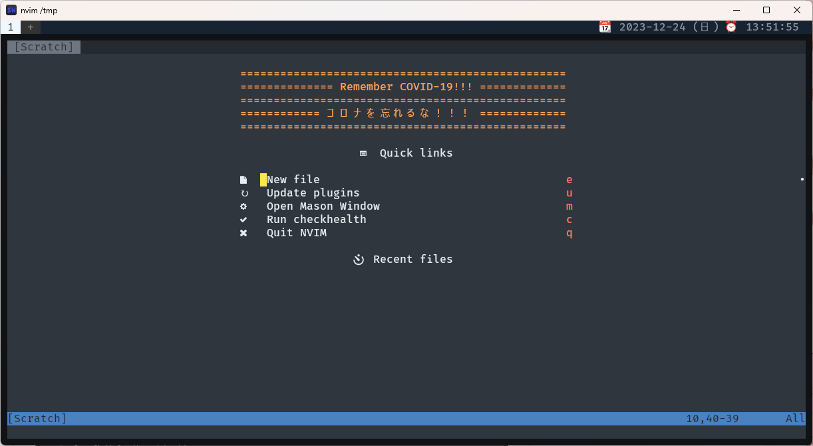

# dotfiles


## Overview

mimikun's dotfiles. managed by [chezmoi](https://www.chezmoi.io/).

## Screenshots




## Setup

### Linux

```shell
chezmoi init --apply --verbose https://github.com/mimikun/dotfiles.git
```

### Windows

```shell
chezmoi init --apply --verbose https://github.com/mimikun/dotfiles.git
```

### macOS

WIP (I have not mac now)

## Others

- [Changelog](CHANGELOG.md)
- [Startup time Log](STARTUPTIME.md)
- [various configs](dot_config/README.md)
- [Fish-shell config](dot_config/fish/README.md)
- [neovim config](dot_config/nvim/README.md)
- paleovim(vim) config
  - [.vim](dot_vim/README.md)
  - [.config/vim](dot_config/vim/README.md)
- [Game settings](game_settings/README.md)
- [Files that cannot be managed with chezmoi](misc/README.md)
- [~/.local/bin](private_dot_local/bin/README.md)

## Glossary

- [Glossary](docs/GLOSSARY.md)
