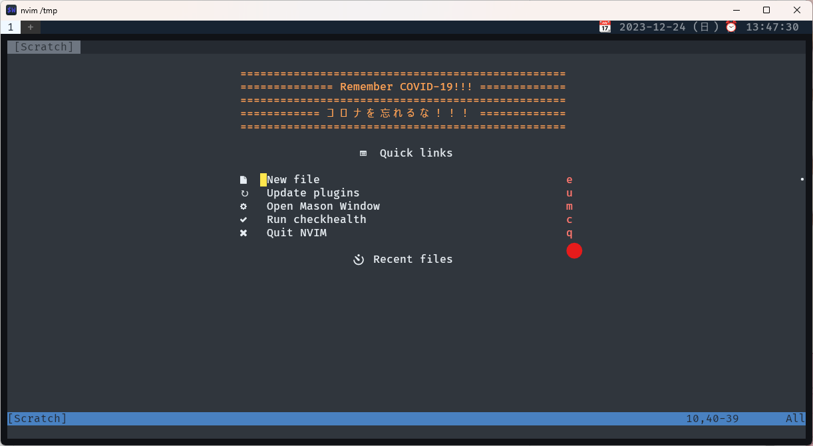

# dotfiles


[](https://github.com/mimikun/dotfiles)

## Overview

mimikun's dotfiles.
managed by [chezmoi](https://www.chezmoi.io/).

## Screenshots



## Setup

### Linux

```shell
chezmoi init --apply --verbose https://github.com/mimikun/dotfiles.git
```

#### SKK JISYOs

File size is too large and cannot be managed by chezmoi.

Must be downloaded manually. (2023.09.19 now)

```shell
make install-skk-jisyo
```

### Windows

```shell
chezmoi init --apply --verbose https://github.com/mimikun/dotfiles.git
```

#### `C:\Program Files\Git\etc\bash.bashrc`

Append to the end of the file:

```bash
# System-wide bashrc file
if [ -f ~/.bashrc ]; then
    source ~/.bashrc
fi
```

#### Place it in `/etc/wsl.conf` of WSL

- `wsl.conf`

#### Place it in `/usr/lib/binfmt.d/WSLInterop.conf` of WSL

- `WSLInterop.conf`

### macOS

WIP

## Others

- [neovim config](dot_config/nvim/README.md)
- [paleovim(vim) config](dot_vim/README.md)
- [config](dot_config/README.md)
- [Fish-shell config](dot_config/fish/README.md)
- [~/.local/bin](private_dot_local/bin/README.md)
- [Changelog](CHANGELOG.md)
- [Startup time Log](STARTUPTIME.md)

## Glossary

- `human rights`
    - e.g. RAM 32GB, Ryzen 9 3900X and 1TB SSD
